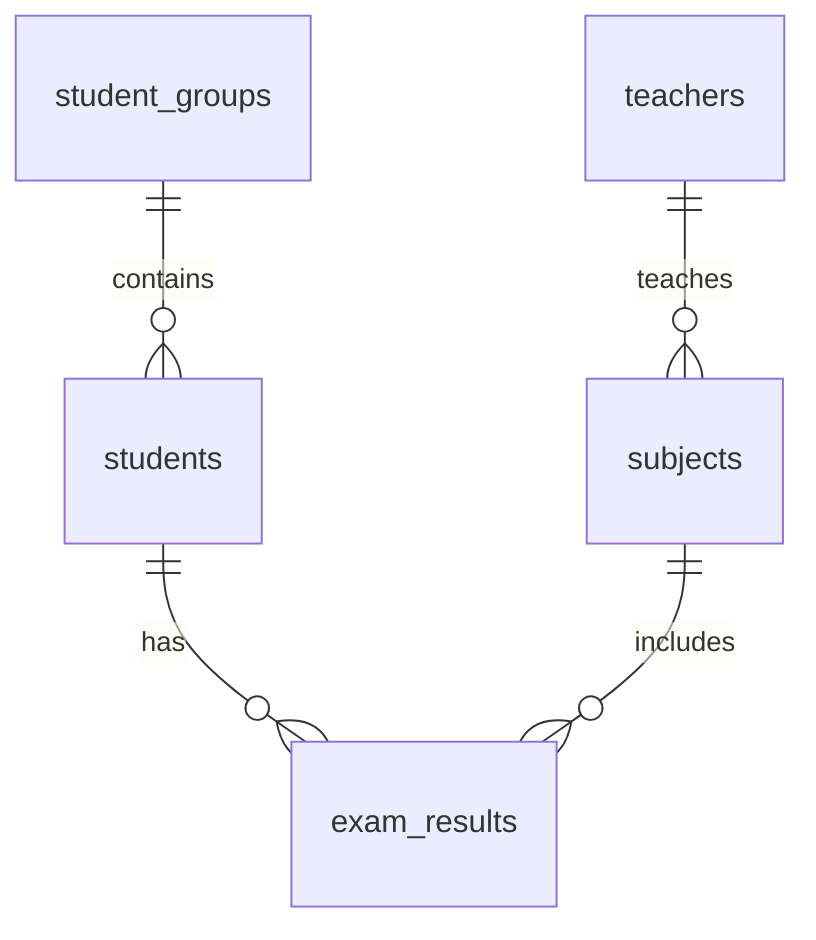

# Homework3

1. Первичный ключ исходной таблицы

Первичный ключ:

```text
(student_id, subject_id, exam_date)
```

Обоснование:

- `student_id` сам по себе не подходит: один студент сдаёт несколько экзаменов.
- `subject_id` сам по себе не подходит: один предмет сдают много студентов.
- `exam_date` сам по себе не подходит: в одну дату может быть много экзаменов.
- `(student_id, subject_id)` может не подойти, если возможна пересдача того же предмета в другую дату.
- `group_id`, `teacher_id` не включаем, потому что:
  - `student_id` уже определяет `group_id`;
  - `subject_id` в рамках задачи определяет `teacher_id`.

Итог: уникальность строки обеспечивает комбинация **студент + предмет + дата экзамена**.

---
2. Функциональные зависимости

Основные ФЗ:

```text
student_id → student_name, group_id
group_id → group_name
teacher_id → teacher_name
subject_id → subject_name, teacher_id
(student_id, subject_id, exam_date) → grade
```

Также полный первичный ключ определяет все остальные атрибуты:

```text
(student_id, subject_id, exam_date) →
    student_name, group_id, group_name,
    teacher_id, teacher_name,
    subject_name, grade
```

---

3. Транзитивные зависимости

Транзитивные зависимости:

```text
student_id → group_id → group_name
subject_id → teacher_id → teacher_name
```

То есть `group_name` зависит от `student_id` не напрямую, а через `group_id`.  
`teacher_name` зависит от `subject_id` не напрямую, а через `teacher_id`.

---

4. Нормальная форма исходной таблицы

Исходная таблица находится в **1НФ**.

Почему:

- все значения атрибутов атомарны;
- нет повторяющихся групп.

Но таблица **не находится во 2НФ**, потому что есть частичные зависимости от составного первичного ключа:

```text
student_id → student_name, group_id
subject_id → subject_name, teacher_id
```

Эти атрибуты зависят не от всего ключа `(student_id, subject_id, exam_date)`, а от его части.  
Следовательно, исходная таблица не во 2НФ и тем более не в 3НФ.

---


После декомпозиции получаются таблицы:

1. `student_groups` — учебные группы.
2. `students` — студенты.
3. `teachers` — преподаватели.
4. `subjects` — предметы.
5. `exam_results` — результаты экзаменов.

### Схема данных

```text
student_groups (1) ───< students (1) ───< exam_results >─── (1) subjects >─── (1) teachers
```

Более подробно:

```text
student_groups
    group_id PK
    group_name

students
    student_id PK
    student_name
    group_id FK → student_groups.group_id

teachers
    teacher_id PK
    teacher_name

subjects
    subject_id PK
    subject_name
    teacher_id FK → teachers.teacher_id

exam_results
    student_id PK, FK → students.student_id
    subject_id PK, FK → subjects.subject_id
    exam_date PK
    grade
```

ER-диаграмма:



---

SQL-запросы

```sql
CREATE TABLE student_groups (
    group_id    VARCHAR(10) PRIMARY KEY,
    group_name  VARCHAR(100) NOT NULL UNIQUE
);

CREATE TABLE teachers (
    teacher_id   INT PRIMARY KEY,
    teacher_name VARCHAR(100) NOT NULL
);

CREATE TABLE students (
    student_id   INT PRIMARY KEY,
    student_name VARCHAR(100) NOT NULL,
    group_id     VARCHAR(10) NOT NULL,
    CONSTRAINT fk_students_group
        FOREIGN KEY (group_id) REFERENCES student_groups(group_id)
);

CREATE TABLE subjects (
    subject_id   INT PRIMARY KEY,
    subject_name VARCHAR(100) NOT NULL UNIQUE,
    teacher_id   INT NOT NULL,
    CONSTRAINT fk_subjects_teacher
        FOREIGN KEY (teacher_id) REFERENCES teachers(teacher_id)
);

CREATE TABLE exam_results (
    student_id INT NOT NULL,
    subject_id INT NOT NULL,
    exam_date  DATE NOT NULL,
    grade      INT NOT NULL,
    PRIMARY KEY (student_id, subject_id, exam_date),
    CONSTRAINT fk_exam_results_student
        FOREIGN KEY (student_id) REFERENCES students(student_id),
    CONSTRAINT fk_exam_results_subject
        FOREIGN KEY (subject_id) REFERENCES subjects(subject_id)
);
```

Если в учебном центре допускаются дробные оценки, поле `grade` можно заменить на:

```sql
grade DECIMAL(2,1) NOT NULL
```

---

Итоговый список таблиц

```text
1. student_groups
2. students
3. teachers
4. subjects
5. exam_results
```

---
